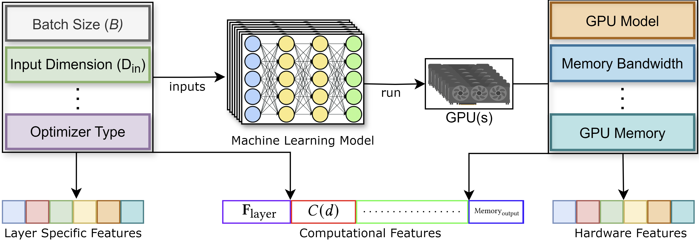
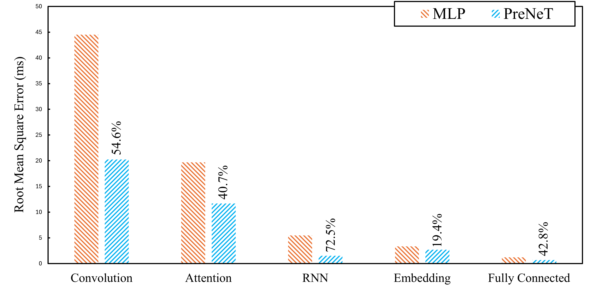

# PreNeT: Leveraging Computational Features to Predict Deep Neural Network Training Time

We have developed a framework that allows users to predict the training time of various deep learning models and architectures. This is achieved by gathering execution times of different deep learning layer types under diverse configurations.

After collecting this data, which is shown in the following figure, we trained and evaluated multiple machine learning models for the regression task of predicting training times for individual layers. The best-performing model for each layer type was selected and is now used to provide accurate predictions of training times. This approach helps users estimate model performance and make informed decisions when designing or optimizing neural networks.

You can find more details about this framework and the experiments in our paper published in ACM/SPEC ICPE 2025: [PreNeT-Paper](./docs/Paper_PreNeT_2025.pdf).




## Setup

To get started, follow the steps below:

1. Clone the repository:

```bash
git clone https://github.com/pacslab/PreNet.git
cd PreNet
```

2. Create and activate a virtual environment:
```bash
python -m virtualenv venv
source ./venv/bin/activate
```

3. Install the required dependencies:
```bash
python -m pip install -r requirements.txt
```


## Training Data Generation
To gather training data for a specific GPU, navigate to the `data_collection` directory and run a benchmark. For example, to test RNN models, use the following command:

```bash
mkdir data
cd data_collection
python run.py --testRNN --num_val=20000 --repetitions=5 --logdir=../data 
```

This command will run the benchmark for RNN models with 20,000 validation examples and repeat the process 5 times to gather data. The results will be saved in the `data` directory.

## Gathered Data
The `data` directory contains a sample of the data we collected for different layer types and GPUs. The data is stored in CSV files, with each row representing a different configuration. It is one-fourth of the original data we collected for the paper. The full dataset is available upon request.


## Experiments

### Selecting the Best Performing Models for Layer Computation Time Prediction
In the first experiment, we focused on identifying the most effective machine learning models for the regression task of predicting the computation time for various types of layers commonly used in deep learning models. Different layer configurations were benchmarked under multiple settings. We evaluated several regression models and selected the top performers based on accuracy and generalization to unseen data. This step was crucial for building robust prediction models that could accurately estimate the computation time of different layer types under various hardware conditions. These are the selected models for each layer type:

<div align="center">

| Layer Type  | Selected Prediction Model |
|:-----------:|:-------------------------:|
| Convolution        | Random Forest             |
| Fully-Connected       | Random Forest             |
| Embedding   | MLP                       |
| Attention   | MLP                       |
| LayerNorm   | MLP                       |
| RNN         | MLP                       |

</div>

### Testing Generalization Across Unseen GPUs
In the second experiment, we assessed how well the prediction models generalize to unseen hardware, specifically GPUs that were not part of the training set. We conducted two variations of this experiment: one with the proposed set of features and one without. By comparing both scenarios, we evaluated the impact of the additional features on model performance. This experiment was designed to determine how well the models could extrapolate their predictions to new hardware environments and how the inclusion of the proposed features influenced prediction accuracy. Here are some of the results for all the benchmarked layers. The numbers on the bars showcase the total improvement in prediction accuracy when using the proposed features trained on an MLP compared to the baseline MLP model.




### Predicting Training Time for Large Models
The final experiment aimed to test the models' capability to predict the training time for larger and more complex machine learning models, such as VGG16 and BERT. These models, due to their size and architectural complexity, provide a challenging test case for the prediction models. We analyzed the models’ performance to see how well they scale when applied to full-scale architectures compared to smaller, individual layers. This experiment provided insights into how effective the prediction models are when tasked with estimating computation times for end-to-end training processes. Here are the results for VGG16 model. The numbers on the bars showcase the total error in prediction for training time under different batch sizes when using the proposed features compared to the baseline model.


